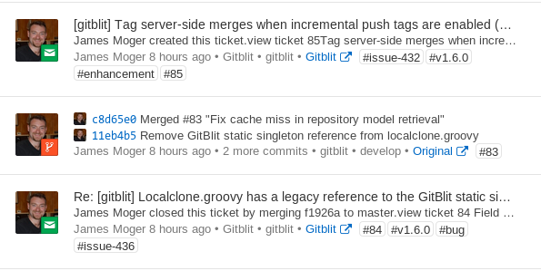

## Gitblit FlowDock plugin

*REQUIRES 1.5.0*

The Gitblit FlowDock plugin provides realtime integration for your FlowDock team.  The plugin inject events into a flow for branch or tag changes and ticket changes.

### Installation

This plugin is referenced in the Gitblit Plugin Registry and you may install it using SSH with an administrator account.

    ssh host plugin refresh
    ssh host plugin install flowdock
    ssh host plugin ls

Alternatively, you can download the zip and manually copy it to your `${baseFolder}/plugins` directory.

### Setup

At a bare minimum you'll need one setting configured in `gitblit.properties`.

    flowdock.defaultToken = aToken

If you have the `powertools` plugin installed, you may configure this over SSH:

    ssh host gb config flowdock.defaultToken aToken

There a handful of additional optional settings:

    flowdock.fixedCommitTags =
    flowdock.fixedTicketTags =
    flowdock.useProjectFlows = false
    flowdock.postPersonalRepos = false
    flowdock.postTickets = true
    flowdock.postTicketComments = true
    flowdock.postBranches = true
    flowdock.postTags = true

#### flowdock.fixedCommitTags

A list of tags to always attach to commit notifications.

<pre>
flowdock.fixedCommitTags = git
</pre>

#### flowdock.fixedTicketTags

A list of tags to always attach to ticket notifications.

<pre>
flowdock.fixedTicketTags = ticket
</pre>

#### flowdock.useProjectFlows

*flowdock.useProjectFlows* allows you to shard Gitblit activity by the repository project.  This may fit better with any security model you may have in place.  These flows *must* already exist in FlowDock, the plugin will not create them for you.

<pre>
flowdock.defaultToken = aToken
flowdock.useProjectFlows = true
flowdock.network.token = 12345
</pre>

- For the *network/a/b/myrepo.git* repository, the flow would be *network*.
- For the *test.git* repository, the flow would be the default flow.

### Usage

#### Ticket Hook

The ticket hook is automatic.

#### Receive Hook

The receive hook is automatic.

#### SSH Commands (optional)

This plugin also provides a generic mechanism to inject messages into a FlowDock flow.  These commands require administrator permissions.

    ssh host flowdock test
    ssh host flowdock send flow -m "'this is a test'"

### Building against a Gitblit RELEASE

    ant && cp build/target/flowdock*.zip /path/to/gitblit/plugins

### Building against a Gitblit SNAPSHOT

    /path/to/dev/gitblit/ant installMoxie
    /path/to/dev/flowdock/ant && cp build/target/flowdock*.zip /path/to/gitblit/plugins

